# Smart Contact Manager (SCM)

A full-stack contact management web application built using Java, Spring Boot, Spring Security, Hibernate/JPA, Thymeleaf, MySQL, Tailwind CSS, and JavaScript.

## Features

- User Registration & Login
- Spring Security Authentication & Authorization
- Google OAuth Login
- Add, Update, Delete Contacts
- Search Contacts
- Pagination Support
- User Profile Management
- Responsive Mobile-Friendly UI
- Ownership-Based Access Control
- Secure Session Management

## Tech Stack

- Java
- Spring Boot
- Spring Security
- Hibernate / JPA
- MySQL
- Thymeleaf
- Tailwind CSS
- JavaScript
- Maven
- Git & GitHub

---

# Desktop Screenshots

## Home Page


## Login Page

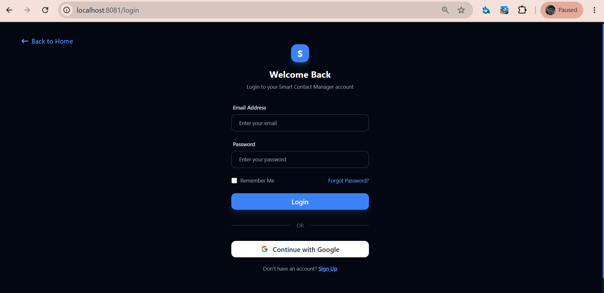

## Registration Page

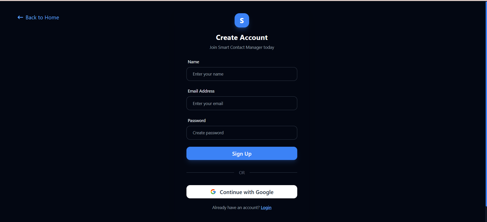

## Dashboard

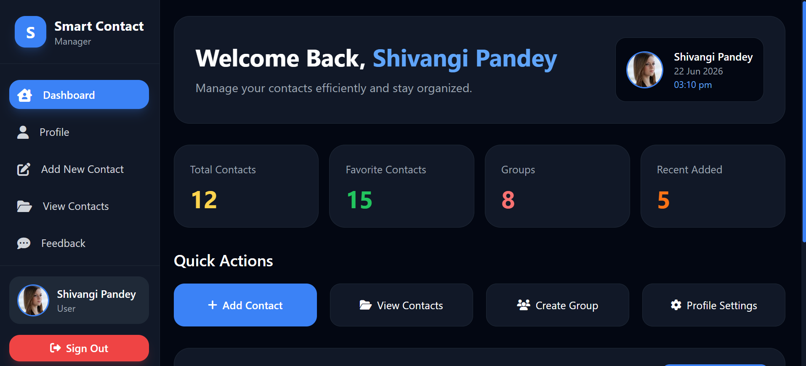

## Add Contact

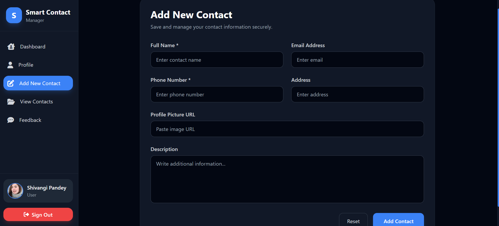

## View Contacts

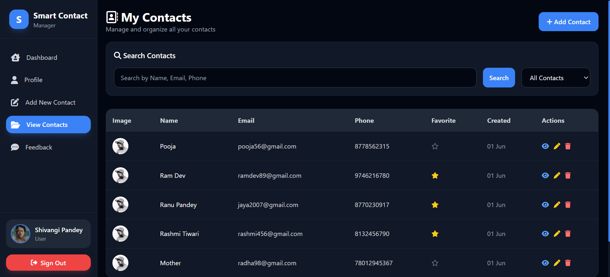

## Search Contacts


## Contact Details

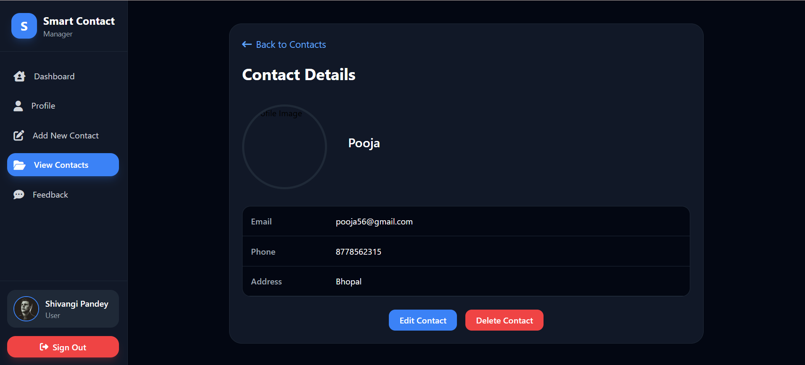

## Edit Contact

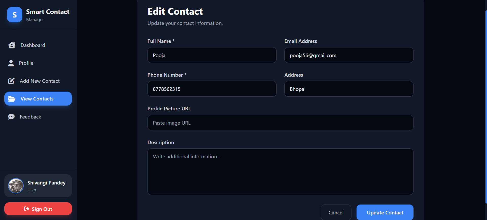

## Profile Page

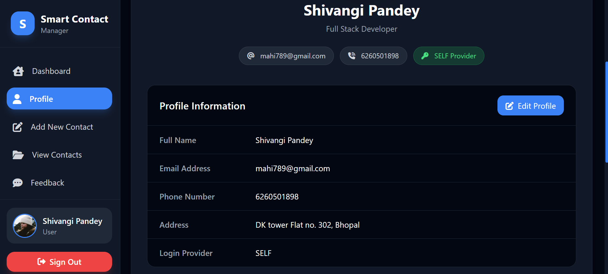

## About Page

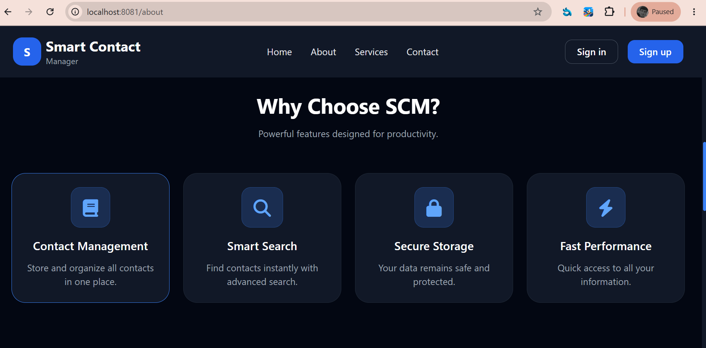

## Contact Us

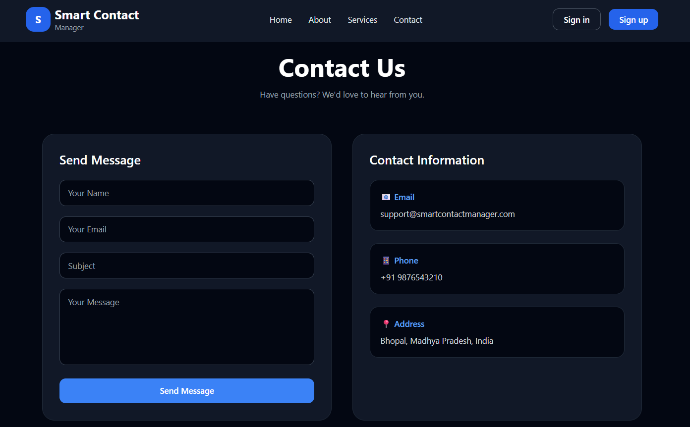

---

# Mobile Responsive Screenshots

## Mobile Home


## Mobile Dashboard

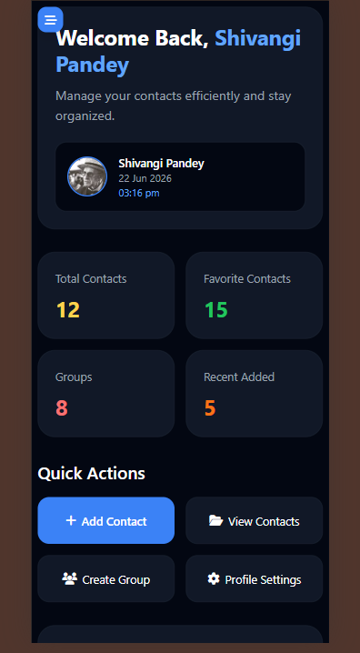

## Mobile Add Contact

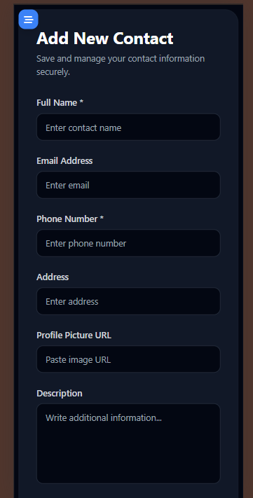

## Mobile View Contact

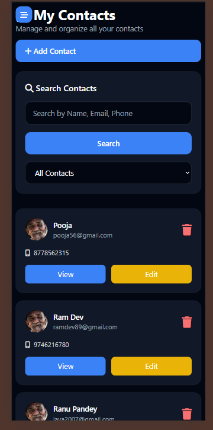

## Mobile Contact Details

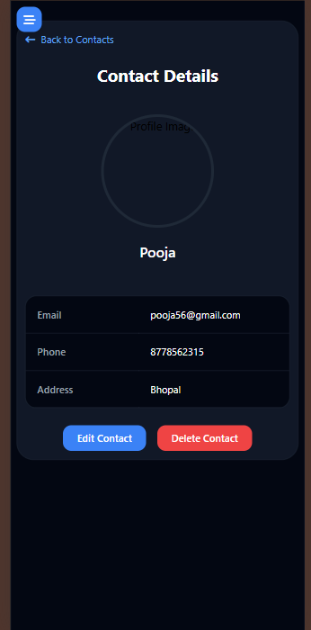

## Mobile Profile

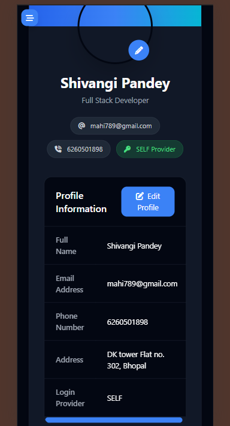

## Mobile About

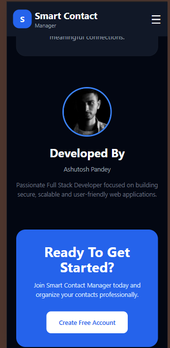

## Mobile Navbar

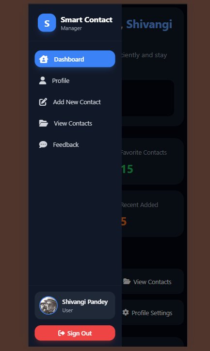

---

## Project Setup

1. Clone the repository

```bash
git clone https://github.com/your-username/scm2.0.git
```

2. Configure MySQL database in `application.properties`

3. Run the Spring Boot application

```bash
mvn spring-boot:run
```

4. Open browser

```text
http://localhost:8080
```

---

## Author

Ashutosh Pandey

Java Backend Developer | Spring Boot Developer
